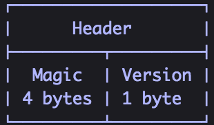

# 存储引擎

## InfluxDB的存储引擎和TSM

新的InfluxDB的存储引擎看起来和LSM树很像。它具有wal和一组只读数据文件，它们在概念上与LSM树中的SSTables类似。 TSM文件包含排序，压缩的series数据。

InfluxDB将为每个时间段创建一个分片。例如，如果您有一个持续时间无限制的存储策略，则会为每7天的时间段创建一个分片。 这些每一个分片都映射到底层存储引擎数据库。 每一个这些数据库都有自己的WAL和TSM文件。 

下面我们来深入存储引擎的这些部分。

### 存储引擎
存储引擎将多个组件结合在一起，并提供用于存储和查询series数据的外部接口。 它由许多组件组成，每个组件都起着特定的作用：
 
* In-Memory Index —— 内存中的索引是分片上的共享索引，可以快速访问measurement，tag和series。 引擎使用该索引，但不是特指存储引擎本身。
* WAL —— WAL是一种写优化的存储格式，允许写入持久化，但不容易查询。 对WAL的写入就是append到固定大小的段中。
* Cache —— Cache是存储在WAL中的数据的内存中的表示。 它在运行时可以被查询，并与TSM文件中存储的数据进行合并。
* TSM Files —— TSM Files中保存着柱状格式的压缩过的series数据。
* FileStore —— FileStore可以访问磁盘上的所有TSM文件。 它可以确保在现有的TSM文件被替换时以及删除不再使用的TSM文件时，创建TSM文件是原子性的。
* Compactor —— Compactor负责将不够优化的Cache和TSM数据转换为读取更为优化的格式。 它通过压缩series，去除已经删除的数据，优化索引并将较小的文件组合成较大的文件来实现。
* Compaction Planner —— Compaction Planner决定哪个TSM文件已准备好进行压缩，并确保多个并发压缩不会彼此干扰。
* Compression —— Compression由各种编码器和解码器对特定数据类型作处理。一些编码器是静态的，总是以相同的方式编码相同的类型; 还有一些可以根据数据的类型切换其压缩策略。
* Writers/Readers —— 每个文件类型（WAL段，TSM文件，tombstones等）都有相应格式的Writers和Readers。

#### Write Ahead Log(WAL)
WAL被组织成一堆看起来像`_000001.wal`这样的文件。 文件编号单调增，并称为WAL段。 当分段达到10MB的大小时，该段将被关闭并且打开一个新的分段。每个WAL段存储多个压缩过的写入和删除块。

当一个新写入的点被序列化时，使用Snappy进行压缩，并写入WAL文件。 该文件是`fsync'd`，并且在返回成功之前将数据添加到内存中的索引。 这意味着批量的数据点写入可以实现更高的性能。（在大多数情况下，最佳批量大小似乎是每批5,000-10,000点。）

WAL中的每个条目都遵循[TLV标准](https://en.wikipedia.org/wiki/Type-length-value)，以一个单字节表示条目类型（写入或删除），然后压缩块长度的4字节`uint32`，最后是压缩块。

#### Cache
缓存是对存储在WAL中的所有数据点的内存拷贝。这些点由这些key组成，他们是measurement，tag set和唯一field组成。每个field都按照自己的有序时间范围保存。缓存数据在内存中不被压缩。

对存储引擎的查询将会把Cache中的数据与TSM文件中的数据进行合并。在查询运行时间内，对数据副本的查询都是从缓存中获取的。这样在查询进行时写入的数据不会被查询出来。

发送到缓存的删除指令，将清除给定键或给定键的特定时间范围的数据。

缓存提供了一些控制器用于快照。两个最重要的控制器是内存限制。 有一个下限，`cache-snapshot-memory-size`，超出时会触发快照到TSM文件，并删除相应的WAL段。 还有一个上限，`cache-max-memory-size`，当超出时会导致Cache拒绝新的写入。 这些配置有助于防止内存不足的情况，并让客户端写数据比实例可承受的更快。

内存阈值的检查发生在每次写入时。

还有快照控制器是基于时间的。`cache-snapshot-write-cold-duration`，如果在指定的时间间隔内没有收到写入，则强制缓存到TSM文件的快照。

通过重新读取磁盘上的WAL文件，可以重新创建内存中缓存。

#### TSM Files
TSM files是内存映射的只读文件的集合。 这些文件的结构看起来与LevelDB中的SSTable或其他LSM Tree变体非常相似。

一个TSMfile由四部分组成：header，blocks，index和footer:

Header是识别文件类型和版本号的一个魔法数字:

blocks是一组CRC32校验和数据对的序列。  
block数据对文件是不透明的。   
CRC32用于块级错误检测。  
block的长度存储在索引中。

blocks之后是文件中blocks的索引。索引由先按key顺序，如果key相同则按时间顺序排列的索引条目序列组成。key包括measurement名称，tag set和一个field。如果一个点有多个field则在TSM文件中创建多个索引条目。每个索引条目以密钥长度和密钥开始，后跟block类型（float，int，bool，string）以及该密钥后面的索引block条目数的计数。 然后是每个索引block条目，其由block的最小和最大时间组成，之后是block所在的文件的偏移量以及block的大小。 包含该key的TSM文件中每个block都有一个索引block条目。

索引结构可以提供对所有block的有效访问，以及能够确定访问给定key相关联数据需要多大代价。给定一个key和时间戳，我们可以确定文件是否包含该时间戳的block。我们还可以确定该block所在的位置，以及取出该block必须读取多少数据。了解了block的大小，我们可以有效地提供IO语句。 

最后一部分是footer，它存储了索引开头的offset。

#### Compression
每个block都被压缩，以便减少存储空间和查询时磁盘IO。block包含时间戳和给定seris和field的值。每个block都有一个字节的header，之后跟着压缩过的时间戳，然后是压缩后的值。

时间戳和值都会被压缩，并使用依赖于数据类型及其形状的编码分开存储。独立存储允许时间戳编码用于所有时间戳，同时允许不同字段类型的不同编码。例如，一些点可能能够使用游程长度编码，而其他点可能不能。

每个值类型还包含一个1byte的header，表示剩余字节的压缩类型。 四个高位存储压缩类型，如果需要，四个低位由编码器使用。

##### Timestamps
时间戳编码是自适应的，并且基于被编码的时间戳的结构。它使用delta编码，缩放和使用simple8b游程编码压缩的组合，当然如果需要，可以回退到无压缩。

时间戳分辨率是可变的，可以像纳秒一样粒度，最多需要8个字节来存储未压缩的时间戳。在编码期间，这些值首先进行delta编码。第一个值是起始时间戳，后续值是与先前值的差值。这通常将值转换成更小的整数，更容易压缩。许多时间戳也是单调增加，并且在每10秒的时间的均匀边界上落下。当时间戳具有这种结构时，它们由也是10的因子的最大公约数来缩放。这具有将非常大的整数增量转换成更小的压缩更好的效果。

使用这些调整值，如果所有delta都相同，则使用游程编码来存储时间范围。如果游程长度编码是不可能的，并且纳秒分辨率的所有值都小于（1 << 60）-1（[〜36.5年](https://www.wolframalpha.com/input/?i=\(1+%3C%3C+60)+ - + 1 +纳秒+至+年）），则使用[simple8b编码](https://github.com/jwilder/encoding/tree/master/simple8b)对时间戳进行编码。 Simple8b编码是一个64位字对齐的整数编码，将多个整数打包成一个64位字。如果任何值超过最大值，则使用每个块的8个字节对未压缩的三进制进行存储。未来的编码可能使用修补方案，如“Patched Frame-Of-Reference (PFOR)”来更有效地处理异常值。

##### Floats
使用[Facebook Gorilla paper](http://www.vldb.org/pvldb/vol8/p1816-teller.pdf)实现对浮点数的编码。当值靠近在一起时，编码将连续值XORs连在一起让结果集变得更小。然后使用控制位存储增量，以指示XOR值中有多少前导零和尾随零。我们的实现会删除paper中描述的时间戳编码，并且仅对浮点值进行编码。

##### Integers
整数编码使用两种不同的策略，具体取决于未压缩数据中的值的范围。编码值首先使用[ZigZag编码](https://developers.google.com/protocol-buffers/docs/encoding?hl=en#signed-integers)进行编码。这样在正整数范围内交错正整数和负整数。 

例如，[-2，-1,0,1]变成[3,1,0,2]。 有关详细信息，请参阅Google的[Protocol Buffers文档](https://developers.google.com/protocol-buffers/docs/encoding?hl=en#signed-integers)。 

如果所有ZigZag编码值都小于（1 << 60）-1，则使用simple8b编码进行压缩。如果有值大于最大值，则所有值都将在未压缩的块中存储。如果所有值相同，则使用游程长度编码。这对于频繁不变的值非常有效。

##### Booleans
布尔值使用简单的位打包策略进行编码，其中每个布尔值使用1位。使用可变字节编码在块的开始处存储编码的布尔值的数量。

##### Strings
字符串使用[Snappy](http://google.github.io/snappy/)压缩进行编码。每个字符串连续打包，然后被压缩为一个较大的块。

#### Compactions
Compactions是将以写优化格式存储的数据迁移到更加读取优化的格式的循环过程。在分片写入时，会发生Compactions的许多阶段：

* Snapshots —— Cache和WAL中的数据必须转换为TSM文件以释放WAL段使用的内存和磁盘空间。这些Compactions基于高速缓存和时间阈值进行。
* Level Compactions —— Level Compactions（分为1-4级）随TSM文件增长而发生。TSM文件从snapshot压缩到1级文件。多个1级文件被压缩以产生2级文件。该过程继续，直到文件达到级别4和TSM文件的最大大小。除非需要运行删除，index optimization compactions或者full compactions，否则它们会进一步压缩。较低级别的压缩使用避免CPU密集型活动（如解压缩和组合块）的策略。 较高的水平（因此较不频繁）的压缩将重新组合块来完全彻底压缩它们并增加压缩比。
* Index Optimization —— 当许多4级TSM文件累积时，内部索引变大，访问成本更高。Index Optimization compaction通过一组新的TSM文件分割series和index，将给定series的所有点排序到一个TSM文件中。 在Index Optimization之前，每个TSM文件包含大多数或全部series的点，因此每个TSM文件包含相同的series索引。Index Optimization后，每个TSM文件都包含从最小的series中得到的点，文件之间几乎没有series重叠。因此，每个TSM文件具有较小的唯一series索引，而不是完整series列表的副本。此外，特定series的所有点在TSM文件中是连续的，而不是分布在多个TSM文件中。
* Full Compaction —— 当分片数据已经写入很长时间(也就是冷数据)，或者在分片上发生删除时，Full Compaction就会运行。Full Compaction产生最佳的TSM文件集，并包括来自Level和Index Optimization的所有优化。一旦一个shard上运行了Full Compaction，除非存储有新的写入或删除，否则不会在其上运行其他压缩。

#### Writes(写)
写入是同时写到WAL的segment和Cache中。每个WAL segment都有最大尺寸。一旦当前文件填满，将写入一个新文件。Cache也有大小限制，当Cache满了之后，会产生snapshot并且启动WAL的compaction。如果在一定时间内，写入速率超过了WAL的compaction速率，则Cache可能变得过满，在这种情况下，新的写入将失败直到snapshot进程追赶上。

当WAL segment填满并关闭时，Compactor会将Cache并将数据写入新的TSM文件。当TSM文件成功写入和`fsync`'d时，它将会被FileStore加载和引用。

#### Updates(更新)
正常写入会发生更新（为已存在的点写入较新的值），由于缓存值覆盖现有值，因此较新的写入优先。如果写入将覆盖先前TSM文件中的一个点，则这些点在查询运行时会合并，较新的写入优先。

#### Deletes(删除)
通过向measurement或series的WAL写入删除条目然后更新Cache和FileStore来进行删除。这时Cache会去掉所有相关条目，FileStore为包含相关数据的每个TSM文件写入一个tombstone文件。这些tombstone文件被用于在启动时忽略相应的block，以及在compaction期间移除已删除的条目。

在compaction完全从TSM文件中删除数据之前，部分删除的series在查询时处理。

#### Queries(查询)
当存储引擎执行查询时，它本质上是寻找给定时间相关的特定series key和field。首先，我们对数据文件进行搜索，以查找包含与查询匹配的时间范围以及包含匹配series的文件。

一旦我们选择了数据文件，我们接下来需要找到series key索引条目的文件中的位置。我们针对每个TSM索引运行二进制搜索，以查找其索引块的位置。 

在通常的情况下，这些块不会跨多个TSM文件重叠，我们可以线性搜索索引条目以找到要读取的起始块。如果存在重叠的时间块，则索引条目将被排序，以确保较新的写入将优先，并且可以在查询执行期间按顺序处理该块。

当迭代索引条目时，块将从其位置顺序地被读取。该块被解压缩，以便我们寻求具体的数据点。

## 新的InfluxDB存储引擎：从LSM树到B+树，然后重新创建TSM
写一个新的存储引擎应该是最后的手段。那么InfluxData最终如何写我们自己的引擎的呢？InfluxData已经尝试了许多存储格式，发现每个在某一方面都有一些缺点。InfluxDB的性能要求非常高，当然最终压倒了其他存储系统。InfluxDB的0.8版本允许多个存储引擎，包括LevelDB，RocksDB，HyperLevelDB和LMDB。 InfluxDB的0.9版本使用BoltDB作为底层存储引擎。下面要介绍的TSM，它在0.9.5中发布，是InfluxDB 0.11+中唯一支持的存储引擎，包括整个1.x系列。

时间序列数据用例的特性使许多现有存储引擎很有挑战性。在InfluxDB开发过程中，我们尝试了一些更受欢迎的选项。我们从LevelDB开始，这是一种基于LSM树的引擎，针对写入吞吐量进行了优化。之后，我们尝试了BoltDB，这是一个基于内存映射B+ Tree的引擎，它是针对读取进行了优化的。最后，我们最终建立了我们自己的存储引擎，它在许多方面与LSM树类似。

借助我们的新存储引擎，我们可以达到比B+ Tree实现高达45倍的磁盘空间使用量的减少，甚至比使用LevelDB及其变体有更高的写入吞吐量和压缩率。这篇文章将介绍整个演变的细节，并深入了解我们的新存储引擎及其内部工作。

### 时序数据的特性
时间序列数据与正常的数据库工作负载有很大的不同。有许多因素使得它难以提高和保持性能：

* 数十亿个数据点
* 高吞吐量的写入
* 高吞吐量的读取
* 大量删除（数据到期）
* 大部分数据是插入/追加，很少更新

第一个也是最明显的问题是规模。在DevOps，IoT或APM中，每天很容易收集数亿或数十亿的数据点。 

例如，假设我们有200个VM或服务器运行，每个服务器平均有100个measurement每10秒收集一次。鉴于一天中有86,400秒，单个measurement每个服务器将在一天内产生8,640点。这样我们每天总共200 * 100 * 8,640 = 172,800,000个数据点。我们在传感器数据用例中还可以找到类似或更大的数字。

数据量大意味着写入吞吐量可能非常高。一些较大的公司一般需要每秒处理数百万次写入的系统。 

同时，时间序列数据也可能是需要高吞吐量读取的。的确，如果您正在跟踪70万个metric或时间序列，那么你肯定不希望将其全部可视化。这导致许多人认为您实际上并没有读取大量数据的需求。然而，除了人们在屏幕上的仪表板之外，还有自动化系统用于监视或组合大量时间序列数据与其他类型的数据。

在InfluxDB内部，实时计算的聚合函数可将数万个不同时间series组合成单个视图。这些查询中的每一个都必须读取每个聚合数据点，因此对于InfluxDB，读取吞吐量通常比写入吞吐量高许多倍。

鉴于时间序列大多是顺序插入，你可能会认为可以在B+树上获得出色的性能，因为顺序插入是高效的，您可以达到每秒100,000以上。但是，我们有这些数据的写入发生在不同的时间序列。因此，插入最终看起来更像是随机插入，而不仅仅是顺序插入。

使用时间序列数据发现的最大问题之一是，在超过一定时间后需要删除所有数据。这里的常见模式是用户拥有高精度的数据，保存在短时间内，如几天或几个月。然后用户将数据采样并将其汇总到保存较长时间的较低精度数据。

最容易的实现将是简单地删除每个记录一旦超过其过期时间。然而，这意味着一旦写入的第一个点到达其到期日期，系统正在处理与写入一样多的删除，大多数存储引擎都不会这样去设计的。 

我们来看看我们尝试过的两种存储引擎的细节，以及这些特性对我们性能的重大的影响。

### LevelDB和LSM树
当InfluxDB项目开始时，我们选择了LevelDB作为存储引擎，因为我们将其用于作为InfluxDB前身的产品中的时间序列数据存储。我们知道它具有很好的写入吞吐量，但一切似乎都“just work”。 

LevelDB是在Google构建为开源项目的Log Structured Merge Tree（或LSM树）的实现。 它暴露了键/值存储的API，其中key space是经过排序的。这最后一部分对于时间序列数据很重要，只要把时间戳放在key中，就允许我们快速扫描时间范围。

LSM树基于采用写入和两个称为Mem Tables和SSTables的结构的日志。 这些tables代表了排序的keyspace。SSTables是只读文件，只能被其插入和更新的其他SSTables所替换。 

LevelDB为我们带来的两大优势是写入吞吐量高，内置压缩。 然而，当我们从时间序列数据中了解到人们需要什么时，我们遇到了一些不可逾越的挑战。

我们遇到的第一个问题是LevelDB不支持热备份。如果要对数据库进行安全备份，则必须将其关闭，然后将其复制。 LevelDB变体RocksDB和HyperLevelDB解决了这个问题，但还有另一个更紧迫的问题，我们认为他们解决不了。

我们的用户需要一种自动管理数据保留的方法。这意味着我们需要大量的删除。在LSM树中，删除与写入一样甚至更加昂贵。删除需要写入一个称为tombstone的新纪录。之后，查询会将结果集与任何tombstone合并，以从查询返回中清除已删除的数据。之后，将执行一个compaction操作，删除SSTable文件中的tombstone和底层删除的记录。

为了避免删除操作，我们将数据分割成我们称之为shard的数据，这些数据是连续的时间块。shard通常会持有一天或七天的数据。每个shard映射到底层的LevelDB。这意味着我们可以通过关闭数据库并删除底层文件来删除一整天的数据。 

RocksDB的用户现在可以提出一个名为ColumnFamilies的功能。当将时间序列数据放入Rocks时，通常将时间块分成列族，然后在时间到达时删除它们。这是一个一般的想法：创建一个单独的区域，您可以在删除大量数据时只删除文件而不是更新索引。 删除列族是一个非常有效的操作。然而，列族是一个相当新的功能，我们还有另一个shard的用例。

将数据组织成shard意味着它可以在集群内移动，而不必检查数十亿个key。在撰写本文时，不可能将RocksDB中的列族移动到另一个。旧的碎片通常是冷写的，所以移动它们将会很便宜而且代价很小。我们将获得额外的好处是在keyspace中存在一个写冷的地方，所以之后进行的一致性检查会更容易。

将数据组织到shard中运行了一段时间，直到大量的数据进入InfluxDB。 LevelDB将数据分解成许多小文件。在单个进程中打开数十个数百个这些数据库，最终造成了一个大问题。有六个月或一年数据的用户将用尽文件句柄。这不是我们与大多数用户发现的，任何将数据库推到极限的人都会遇到这个问题，我们没有解决。打开的文件柄实在太多了。

### BoltDB和mmap B+树
在与LevelDB及其变体一起挣扎了一年之后，我们决定转移到BoltDB，BoltDB是一个纯粹的Golang数据库，它受到LMDB的高度启发，这是一个用C编写的mmap B+ Tree数据库。它具有与LevelDB相同的API语义：keyspace有序地存储。我们的许多用户感到惊讶，我们自己发布的LevelDB变体与LMDB（mmap B+ Tree）的测试显示，RocksDB是表现最好的。 

然而，在纯粹的写的表现之外，还有其他因素需要考虑进来。 在这一点上，我们最重要的目标是获得可以在生产和备份中运行的稳定的东西。BoltDB还具有以纯Go编写的优势，它极大地简化了我们的构建链，并使其易于构建在其他操作系统和平台上。

对我们来说，最大的好处是BoltDB使用单个文件作为数据库。在这一点上，我们之前最常见的bug报告来源是用户用尽了文件句柄。Bolt还同时解决了热备份问题和文件限制问题。

如果这意味着我们可以建立一个更可靠和稳定的系统，我们愿意对写入吞吐量上作出妥协。 我们的理由是，对于任何人想要真正大的写入负载，他们将会运行一个集群。我们根据BoltDB发布了0.9.0到0.9.2版本。从发展的角度来看，这是令人愉快的。 简洁的API，快速轻松地构建在我们的Go项目中，并且可靠。 然而，运行一段时间后，我们发现了写入吞吐量的一大问题。在数据库超过几GB之后，IOPS开始成为瓶颈。

有些用户可以通过将InfluxDB放在具有接近无限制IOPS的大硬件上，从而达到这个目标。但是，大多数用户都是云端资源有限的虚拟机。 我们必须找出一种方法来减少同时将一堆数据写入到成百上千个series的影响。

随着0.9.3和0.9.4版本的发布，我们的计划是在Bolt面前写一个WAL，这样我们可以减少随机插入到keyspace的数量。相反，我们会缓冲彼此相邻的多个写入，然后一次flush它们 但是，这仅仅是为了延缓了这个问题。高IOPS仍然成为一个问题，对于任何在适度工作负荷的场景下，它都会很快出现。 

然而，我们在Bolt面前建立一个WAL实施的经验使我们有信心可以解决写入问题。WAL本身的表现太棒了，索引根本无法跟上。在这一点上，我们再次开始思考如何创建类似于LSM Tree的东西，使之可以跟上我们的写入负载。

这就是TSM Tree的诞生过程。